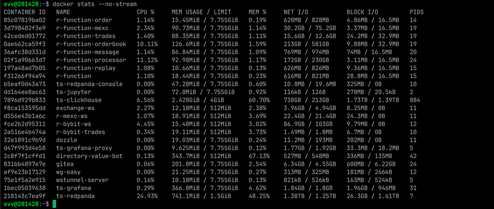

# r-function

**Real-time pipeline для конфигурируемой обработки потоков сообщений с пользовательской логикой в WebAssembly-песочнице, версионированием через Git и детерминированным replay.**

## Архитектура

```
        ┌──────────────┐     ┌──────────────────────┐     ┌──────────────┐
Kafka → │   Consumer   │ →→  │       Pipeline       │ →→  │   Producer   │ → Kafka
        └──────────────┘     └──────────┬───────────┘     └──────────────┘
                                        │
                                        ▼
                              ┌───────────────────────┐
                              │     Processor         │
                              │  ┌─────────────────┐  │   ┌────────────┐
                              │  │   WasmRuntime   │◄─┼───┤    Git     │
                              │  └─────────────────┘  │   └─────┬──────┘
                              │  ┌─────────────────┐  │         │
                              │  │ function_value  │◄─┼─────────┤  Git stores
                              │  │ (Git, read-only)│  │         │  
                              │  └─────────────────┘  │         │  
                              │  ┌─────────────────┐  │         │
                              │  │     Values      │  │
                              │  │  KV cache (R/W) │  │
                              │  └─────────────────┘  │
                              └───────────────────────┘
```

